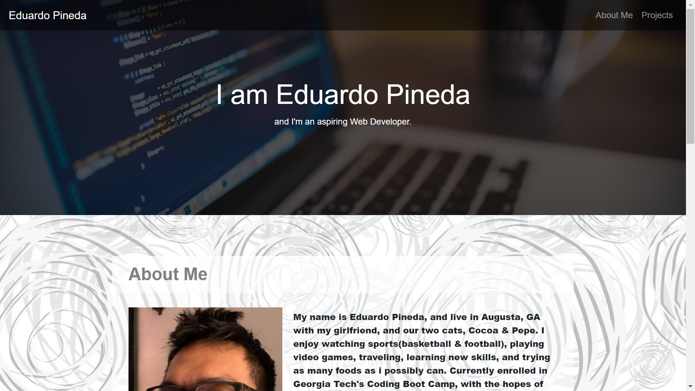
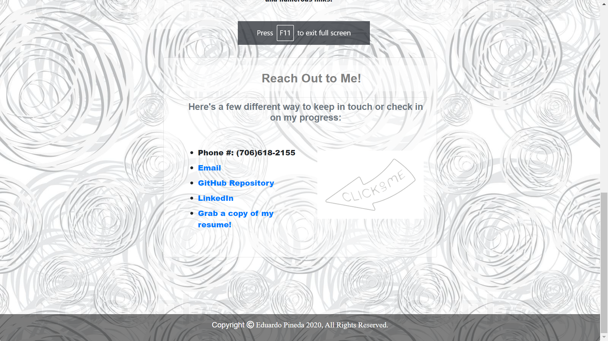
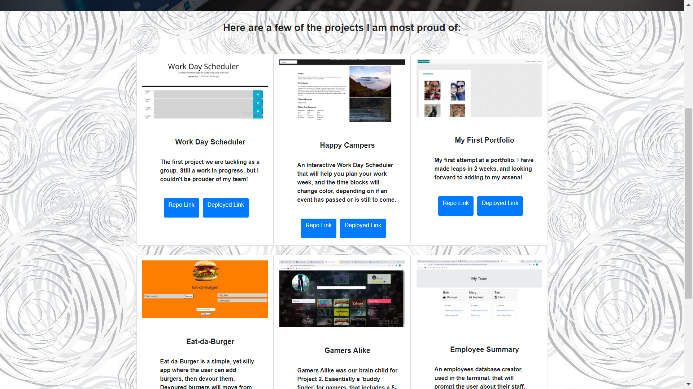

# Eduardo Pineda's Portfolio

## Description

This is my updated portfolio that uses strictly React JS. It includes information about who I am as a person, as well as contact information and links to my GitHub, LinkedIn, and my resume. Also, there is a Projects page that showcases 6 projects that I'm most proud of, along with with links to the deployed version and repo.

## Installation

Employee is installed by first cloning the repo from [Edibozu](https://github.com/Edibozu/epineda-portfolio). Once cloned, the code can be viewed in VS Code. The application itself is deployed on [Heroku](https://epineda-portfolio.herokuapp.com/).
  
This is the main page of the portfolio. you get to see my Navbar, and also the start of the "About Me" card.
  

  
Here is my "Contact" card, along with all of the links to reach me and also my resume.
  

  
Here is my "Portfolio" page, showcasing 6 of my projects
  

   

## Questions

For any questions, contact me on any of the following links:

Email: edibozu@gmail.com

Heroku: https://epineda-portfolio.herokuapp.com/

GitHub Repo: https://github.com/Edibozu/epineda-portfolio

LinkedIn: https://www.linkedin.com/in/eduardo-pineda-5595431b6/

## Contributions

This application was aided by my fellow classmates during our after class study sessions.

## License

MIT License

Copyright (c) [2020] [Eduardo Pineda]

Permission is hereby granted, free of charge, to any person obtaining a copy
of this software and associated documentation files (the "Software"), to deal
in the Software without restriction, including without limitation the rights
to use, copy, modify, merge, publish, distribute, sublicense, and/or sell
copies of the Software, and to permit persons to whom the Software is
furnished to do so, subject to the following conditions:

The above copyright notice and this permission notice shall be included in all
copies or substantial portions of the Software.

THE SOFTWARE IS PROVIDED "AS IS", WITHOUT WARRANTY OF ANY KIND, EXPRESS OR
IMPLIED, INCLUDING BUT NOT LIMITED TO THE WARRANTIES OF MERCHANTABILITY,
FITNESS FOR A PARTICULAR PURPOSE AND NONINFRINGEMENT. IN NO EVENT SHALL THE
AUTHORS OR COPYRIGHT HOLDERS BE LIABLE FOR ANY CLAIM, DAMAGES OR OTHER
LIABILITY, WHETHER IN AN ACTION OF CONTRACT, TORT OR OTHERWISE, ARISING FROM,
OUT OF OR IN CONNECTION WITH THE SOFTWARE OR THE USE OR OTHER DEALINGS IN THE
SOFTWARE.
